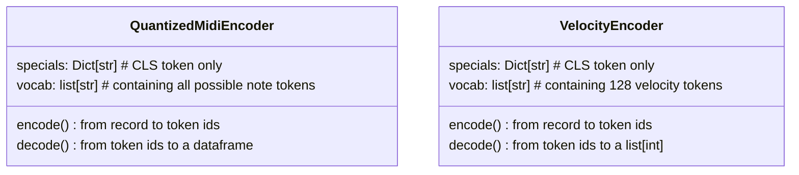
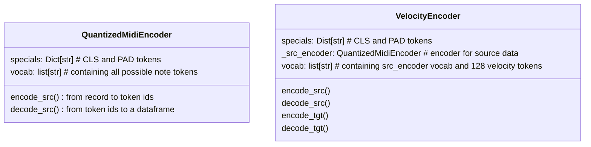

## Analysis of differences in data and training in midi-hf-transformers and midi-translation projects.


### Abstract
I will outline the data flow within both projects, point out similarities in architecture, data, and training
hyperparameters, voice my expectations, and show how they have not been met.
### Data
In both projects, the data processed by the encoder objects is identical at the input to these encoders.
They use precisely the same functions, particularly when using "dstart" as the time-quantization method.
To specify, the data beforehand is a table with 9 columns and 128 rows, with each row describing a note.

| pitch | dstart_bin | duration_bin | velocity_bin | start | end | quant_start | quant_duration | velocity | source |
|-------|------------|--------------|--------------|-------|-----|-------------|----------------|----------|--------|

Quantization bins remain the same. Everything remains the same.

### Encoders
What changed in the encoders?

HuggingFace transformers use the same input and output layer sizes, which means they use the same
vocabulary for source and output tokens. Staying true to their HF implementation, in midi_hf_transformers
project encoders have ability to encode both source and target sequences with one vocabulary.
#### midi-translation encoders

#### midi-hf-transformers encoders

Huggingface transformer has to learn to use only specific type of words from its vocabulary, yes, but
it seems to grasp it very quickly and reliably. I have never seen a transformer use a token that was not present
among training target tokens. I do not think that the vocabulary size is an issue.

The tokens produced by there two pairs of encoders look exactly the same. For example:
```
tokens from midi-translation encoders:
src: ['<CLS>', '42-0-1-0', '67-0-1-1', '55-0-1-0', '59-0-1-0', '49-0-1-0', '53-1-1-1', '63-0-2-1', ... ]
tgt: ['<CLS>', '6', '73', '53', '42', '42', '68', '69', '78', '62', '79', '60', '55', '84', '75', ... ]
tokens from midi-hf-transformers encoder:
src: ['<CLS>', '42-0-1-0', '67-0-1-1', '55-0-1-0', '59-0-1-0', '49-0-1-0', '53-1-1-1', '63-0-2-1', ... ]
tgt: ['<CLS>', '6', '73', '53', '42', '42', '68', '69', '78', '62', '79', '60', '55', '84', '75', ... ]
```
They do differ in token ids (obviously):
```
midi-translation:
src: [ 0,  571, 1247,  922, 1030,  760,  878, 1142, 1386,  548, 1287,  719, ... ]
tgt: [ 0,   7,  74,  54,  43,  43,  69,  70,  79,  63,  80,  61,  56,  85, ... ]

midi-hf-transformers:
src: [ 0,  572, 1248,  923, 1031,  761,  879, 1143, 1387,  549, 1288,  720, ... ]
tgt: [ 0, 2384, 2451, 2431, 2420, 2420, 2446, 2447, 2456, 2440, 2457, 2438, ... ]
```
### Architecture
Creators of T5 project, in
[*"Exploring the Limits of Transfer Learning with a Unified Text-to-Text Transformer"*](https://arxiv.org/pdf/1910.10683.pdf)
claim T5 architecture is exactly the same as described in [*"Attention is All You Need"*](https://arxiv.org/abs/1706.03762).
That means it is also the same as our midi-translation model.

In both midi-translation and midi-hf-transformers projects we are able to change some of the model hyperparameters
such as:
```
  d_model
  d_kv
  d_ff
  num_layers
  num_heads
```
### Training
#### Learning rate schedule
midi-translation uses learning rate schedule given with equation:

lrate = d_model^(0.5) * min(step_num^(-0.5), step_num * warmup_steps^(-1.5))

It is the exact lr schedule as used in [*"Attention is All You Need"*](https://arxiv.org/abs/1706.03762) paper.
In midi-hf-transformers project learning rate remains the same throughout the training.

#### Loss function
midi-translation transformer uses Label Smoothing loss described in detail in paper [*"Rethinking the inception
architecture for computer vision"*](https://arxiv.org/abs/1512.00567)

HuggingFace transformers use regular cross-entropy loss.

### Experiment
#### Metric
Because loss functions are different, average distance between predicted velocity and ground truth
is used to compare performance of two models.
Because velocity tokens are appearing in the right order and next to each other in vocabularies,
the average distance between velocities is equal to average distance between token ids, so that is what is
really being calculated.
At the beginning of training a T5 model which has much larger output vocabulary this distance is greater,
but when it learns to only use velocity tokens it should behave like in the case of midi-translation model.

#### Expectations
Ideally the T5 model will learn to predict velocities for a sequence of notes as good as (or better than)
out midi-translation model.
That is unfortunately not the case.
#### Parameters and learning rate
Two models with the same hyperparamerets have been trained.
```
model:
  d_model: 256
  d_ff: 1024
  num_layers: 4
  num_heads: 4
```
On the same data:
```
dataset_name: 'roszcz/maestro-v1-sustain'
dataset:
  sequence_len: 128
  sequence_step: 42

  quantization:
    dstart: 5
    duration: 5
    velocity: 3

```
When using warmup_steps=4000, the midi-translation learning rate starts from 2e-7 and rises up to 1e-3 before starting to drop.


Constant learning rate of 3e-6 was used in midi-hf-transformers model.

I also let the HF model run for 25 epochs instead of 5, taking into consideration that maybe all
learning schedule does is speed up the training...

#### Results
##### midi-translation
check out [wandb](https://wandb.ai/wmatejuk/midi-transformer/runs/8ph9j07e?workspace=user-wmatejuk)
```
val_loss: 2.486
val_dist: 4.682
```
The predictions look like the model knows what it is doing and as if he was really trying to play some
emotional music:


##### midi-hf-transformers
[wandb](https://wandb.ai/wmatejuk/midi-hf-transformer/runs/pcgwhde7?workspace=user-wmatejuk)

```
val_loss: 4.445
val_dist: 11.724
```
Its 2.5 times larger distance than midi-translation and still is one of the best reached by the HF models.

The results look reaaaally flat:


After looking through prediction on train split it seems like the model is learning to predict the mean
of the velocities and spam them for every note instead of actual, more interesting results.

### Conclusions

Both models are fed the same data, use the same dashboard logic and theoretically have the same architecture.

Because of the differences in lr-schedule and loss function huggingface model is unexpectedly pathetic in learning
dynamic expression in music.
Perhaps cross-entropy, while working fine in language domain, fails miserably as effective
metric for musical models and that is where the issue comes from.

I guess that is what I will explore in my next experiment ...
